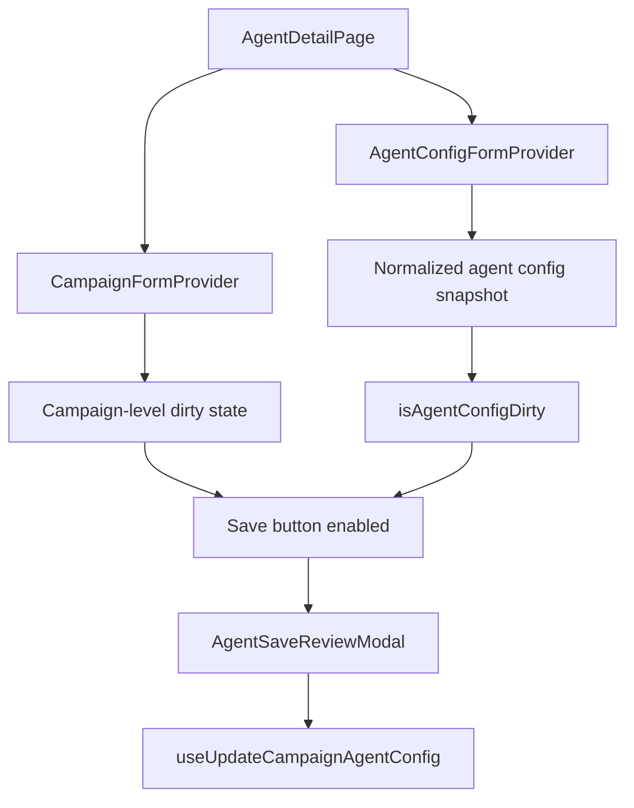

# Agent Details Save Dirty Snapshot

**Date:** 2026-06-12  
**Status:** Draft  
**Driver:** Ramon Mena

## Summary

Update the agent details route at `/campaign/:campaignId/agent/:campaignAgentId`
so the header save button becomes active whenever the user changes any editable
agent detail that is persisted by this page. The main gap today is that the save
button is driven by the campaign form dirty state, while several agent-detail
fields live in `agentConfigForm` instead.

This spec uses the agreed approach 1:

- Keep the current campaign dirty state as-is
- Add a normalized snapshot comparison for the agent detail form state
- Enable save when either source reports changes
- Keep Analytics out of this scope

## Problem

The agent detail page already edits data through multiple state surfaces:

- `CampaignFormProvider` for campaign-level fields and version description
- `AgentConfigFormProvider` for agent config fields
- Dedicated inline save flows for workflow and some advanced sections

The header save button currently depends on `form.isDirty()` from the campaign
form only. That means it can miss changes in the agent config tab content, such
as:

- prompt
- language
- firstMessage
- other persisted agent config details surfaced in the agent detail page

This creates a mismatch between what the user edits and when the save affordance
appears active.

## Goals

- Activate the header save button when agent-detail fields change
- Preserve the existing campaign dirty behavior
- Keep workflow save behavior unchanged
- Avoid false positives from formatting or empty-string differences
- Keep Analytics out of the dirty comparison

## Non-Goals

- Redesigning the agent detail page layout
- Changing the backend payload shape
- Merging Analytics into the agent detail save flow
- Reworking workflow save/review behavior
- Adding tests unless explicitly requested

## Proposed Approach

Use a composite dirty signal in `AgentDetailPage`:

1. Keep `form.isDirty()` for campaign-level dirty state
2. Add `isAgentConfigDirty` by comparing a normalized snapshot of the current
   `agentConfigForm.values` against the last saved/synced snapshot
3. Enable the save button when either one is dirty

This keeps the implementation local to the page and avoids spreading manual
dirty flags across every child component.

## Snapshot Scope

The agent config snapshot should include the values that are edited on this
route and persisted through the agent config update request:

- `conversationConfig.agent.prompt.prompt`
- `conversationConfig.agent.language`
- `conversationConfig.agent.firstMessage`
- the rest of the current agent config payload already owned by
  `AgentConfigFormProvider`

The snapshot should not include Analytics data, because Analytics lives in the
campaign editor flow and is not part of this route.

## Normalization Rules

The snapshot comparison must normalize values before comparing them so the save
button reflects semantic changes, not formatting noise.

Rules:

- Trim string values before comparison
- Treat empty strings and `undefined` consistently where the backend does not
  distinguish them
- Preserve `null` only where it is a meaningful backend value
- Compare nested objects in a stable shape that mirrors the save payload
- Ignore ordering differences only if the backend itself treats the data as
  unordered

This is important for prompt text, first message, and language values, where a
plain raw object diff can produce false positives.

## Data Flow



### Current Sources

- `CampaignFormProvider` already tracks campaign-level data and version
  description
- `AgentConfigFormProvider` tracks the agent config used by prompt, language,
  firstMessage, tools, knowledge base, system tools, and related agent details

### New Source

- A helper in the agent-details area computes a stable snapshot from
  `agentConfigForm.values`
- The page stores the last known saved snapshot and refreshes it after a
  successful save

## Component and File Changes

| #   | File                                                                                    | Change                                                                 |
| --- | --------------------------------------------------------------------------------------- | ---------------------------------------------------------------------- |
| 1   | `src/modules/agent-details/AgentDetailPage.tsx`                                         | Add composite dirty state and wire the header button to it             |
| 2   | `src/modules/agent-details/AgentDetailTabs.tsx`                                         | No functional change expected; keep workflow/save flow intact          |
| 3   | `src/modules/agent-details/utils/agentDetailDirty.ts`                                   | New helper for snapshot normalization and comparison                   |
| 4   | `src/modules/agent-details/CampaignConfigurationBasic/CampaignConfigurationBasic.tsx`   | No logic change expected; continues to write language and firstMessage |
| 5   | `src/modules/agent-details/CampaignConfigurationPrompt/CampaignConfigurationPrompt.tsx` | No logic change expected; continues to write prompt                    |
| 6   | `src/modules/agent-details/AgentSaveReviewModal/AgentSaveReviewModal.tsx`               | No logic change expected                                               |

## Implementation Detail

### 1. Add a dirty helper

Create a small helper module that exposes:

- a function to build the normalized agent snapshot from `AgentConfigModel`
- a function to compare the current snapshot against the last saved snapshot

The helper should be pure and reusable so `AgentDetailPage` stays readable.

### 2. Capture the initial snapshot

When the page hydrates agent data, store a normalized snapshot representing the
last saved agent state.

This snapshot should be updated after a successful save so the button returns to
its disabled state.

### 3. Derive the active save state

In `AgentDetailPage`, compute:

- `isCampaignDirty = form.isDirty()`
- `isAgentConfigDirty = compareSnapshots(currentAgentConfig, savedAgentConfig)`

Then use:

```ts
const canSave = isCampaignDirty || isAgentConfigDirty;
```

The header save button should be disabled only when `canSave` is false.

### 4. Preserve existing save flows

Do not change:

- workflow save request handling
- review modal behavior
- campaign-level dirty handling
- analytics behavior outside this route

If the workflow tab already manages its own save affordance, leave that path as
is.

## Error Handling

- If the agent config snapshot cannot be built from a malformed value, fall
  back to a conservative comparison that keeps the save button enabled rather
  than hiding a real change
- If save succeeds, always refresh the saved snapshot
- If save fails, keep the dirty state active so the user can retry

## Acceptance Criteria

- Editing prompt text enables save
- Editing firstMessage enables save
- Editing language enables save
- Editing other persisted agent config fields enables save
- Existing campaign-level dirty behavior still enables save
- Analytics is not included in this comparison
- A successful save clears the dirty state

## Testing Notes

No new automated tests are required unless explicitly requested.

Manual validation should cover:

- open `/campaign/:campaignId/agent/:campaignAgentId`
- edit prompt, firstMessage, language, and another agent config field
- verify the save button enables immediately
- save successfully and confirm the button resets
- verify Analytics changes do not affect this page's dirty comparison
