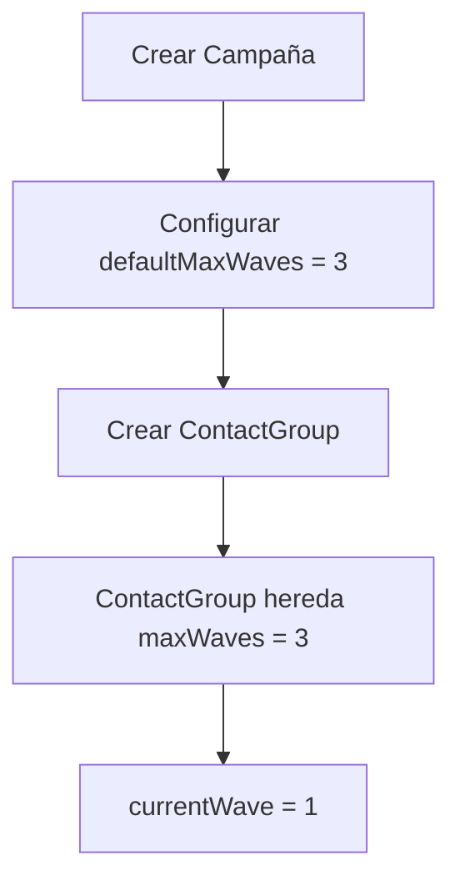
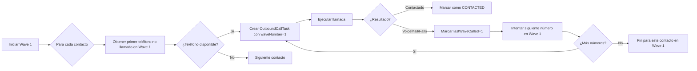
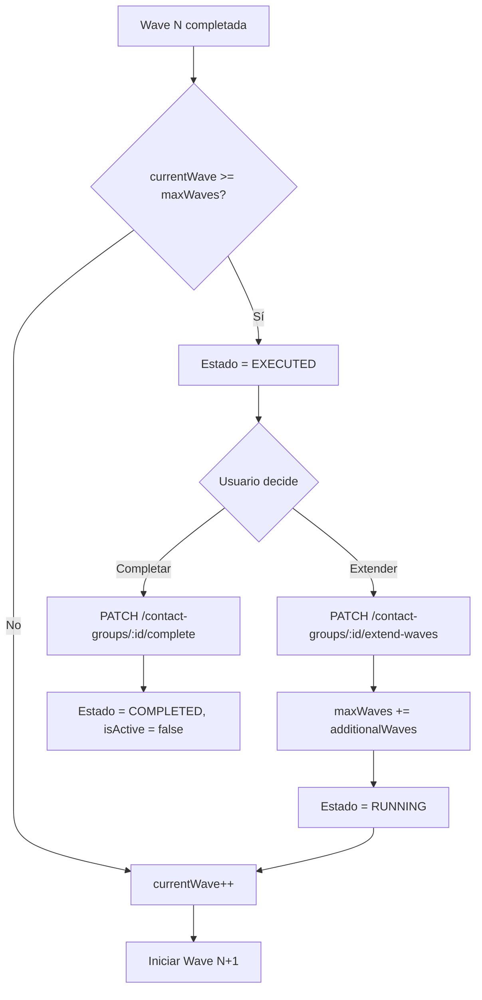
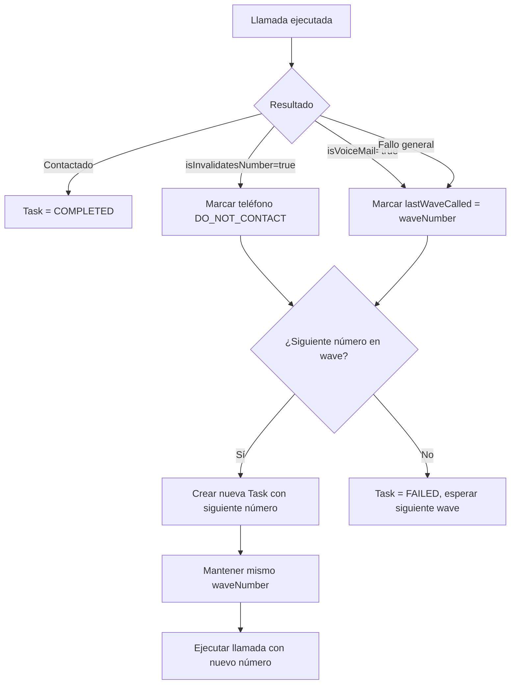

# Sistema de Llamadas Basado en Waves

## Índice

1. [Resumen de Cambios](#resumen-de-cambios)
2. [Comparación: Antes vs Después](#comparación-antes-vs-después)
3. [Flujo del Sistema de Waves](#flujo-del-sistema-de-waves)
4. [Arquitectura Técnica](#arquitectura-técnica)
5. [Cambios en la Base de Datos](#cambios-en-la-base-de-datos)
6. [Endpoints de API](#endpoints-de-api)
7. [Ejemplos de Uso](#ejemplos-de-uso)

---

## Resumen de Cambios

El sistema de llamadas salientes ha sido refactorizado de un modelo basado en **reintentos por número** a un modelo basado en **waves (olas)**, que permite una gestión más flexible y controlada de las campañas de llamadas.

### Objetivos del Cambio

- Permitir que cada wave intente llamar a **todos los números** de cada contacto
- Dar control al usuario sobre cuántas waves ejecutar antes de finalizar
- Facilitar la extensión de campañas sin reactivar manualmente
- Mejorar el tracking de qué números fueron llamados en cada wave

---

## Comparación: Antes vs Después

### Sistema Anterior (Basado en Reintentos)

#### Funcionamiento

```
Contacto tiene 3 números: [Phone1, Phone2, Phone3]
- maxRetryAttempts por número: 3
- retryCounter: contador de intentos por número

Flujo:
1. Llamar Phone1 (retryCounter=0)
2. Si falla → Llamar Phone1 (retryCounter=1)
3. Si falla → Llamar Phone1 (retryCounter=2)
4. Si falla → Llamar Phone1 (retryCounter=3)
5. Agotar reintentos → Pasar a Phone2
6. Repetir proceso con Phone2
7. Repetir proceso con Phone3
8. Marcar contacto como completado
```

#### Limitaciones

- ❌ No se intentaban todos los números antes de reintentar
- ❌ Un número ocupado bloqueaba el acceso a otros números
- ❌ Difícil extender campañas una vez completadas
- ❌ No había visibilidad clara de "rondas" de llamadas
- ❌ Configuración rígida por número

### Sistema Nuevo (Basado en Waves)

#### Funcionamiento

```
Contacto tiene 3 números: [Phone1, Phone2, Phone3]
- defaultMaxWaves: 3 (configurable por campaña)
- lastWaveCalled: registra última wave en que se llamó cada número

Flujo:
Wave 1:
1. Llamar Phone1 (lastWaveCalled=1)
2. Si falla/voicemail → Llamar Phone2 (lastWaveCalled=1)
3. Si falla/voicemail → Llamar Phone3 (lastWaveCalled=1)

Wave 2:
1. Llamar Phone1 (lastWaveCalled=2)
2. Si falla/voicemail → Llamar Phone2 (lastWaveCalled=2)
3. Si falla/voicemail → Llamar Phone3 (lastWaveCalled=2)

Wave 3:
1. Llamar Phone1 (lastWaveCalled=3)
2. Si falla/voicemail → Llamar Phone2 (lastWaveCalled=3)
3. Si falla/voicemail → Llamar Phone3 (lastWaveCalled=3)

Finalización:
- ContactGroup pasa a estado EXECUTED
- Usuario decide: extender waves o marcar como completado
```

#### Ventajas

- ✅ Se intentan todos los números en cada wave
- ✅ Mayor cobertura en menos tiempo
- ✅ Flexibilidad para extender campañas
- ✅ Mejor tracking por wave
- ✅ Control granular del proceso
- ✅ Estado EXECUTED permite decisiones manuales

---

## Flujo del Sistema de Waves

### 1. Configuración Inicial



**Código:**

```typescript
// CampaignModel
{
  id: 1,
  name: "Campaña Q1",
  defaultMaxWaves: 3  // Nuevo campo
}

// ContactGroupModel (hereda de campaign)
{
  id: 100,
  campaignId: 1,
  maxWaves: 3,        // Heredado de campaign.defaultMaxWaves
  currentWave: 1,     // Inicia en 1
  queueStatus: "PENDING"
}
```

### 2. Ejecución de Wave 1



**Ejemplo de Datos:**

```typescript
// Antes de Wave 1
Contact {
  id: 500,
  phoneNumbers: [
    { id: 1, phoneNumber: "8091234567", lastWaveCalled: null },
    { id: 2, phoneNumber: "8099876543", lastWaveCalled: null },
    { id: 3, phoneNumber: "8095551234", lastWaveCalled: null }
  ]
}

// Después de Wave 1 (voicemail en todos)
Contact {
  id: 500,
  phoneNumbers: [
    { id: 1, phoneNumber: "8091234567", lastWaveCalled: 1 },
    { id: 2, phoneNumber: "8099876543", lastWaveCalled: 1 },
    { id: 3, phoneNumber: "8095551234", lastWaveCalled: 1 }
  ]
}
```

### 3. Transición Entre Waves



### 4. Lógica de Retry Dentro de una Wave



### 5. Estados del ContactGroup

```
PENDING → RUNNING → EXECUTED → COMPLETED
    ↑         ↓           ↓
    └─────────┴───────────┘
         (extend-waves)
```

**Descripción de Estados:**

| Estado      | Descripción                                     | isActive | Acciones Disponibles      |
| ----------- | ----------------------------------------------- | -------- | ------------------------- |
| `PENDING`   | Esperando inicio                                | `true`   | Iniciar campaña           |
| `RUNNING`   | Ejecutando waves activamente                    | `true`   | Pausar, monitorear        |
| `EXECUTED`  | Todas las waves completadas, esperando decisión | `true`   | Extender waves, Completar |
| `COMPLETED` | Finalizado permanentemente                      | `false`  | Solo consulta             |
| `FAILED`    | Error irrecuperable                             | `false`  | Reintentar manualmente    |
| `PAUSED`    | Pausado manualmente                             | `true`   | Reanudar                  |

---

## Arquitectura Técnica

### Cambios en Entidades

#### 1. Campaign (Nueva Configuración)

```typescript
@Entity()
export class Campaign {
	// ... campos existentes

	@Column({
		name: 'default_max_waves',
		type: 'integer',
		nullable: false,
		default: () => '3',
		comment: 'Default maximum waves for new contact groups',
	})
	defaultMaxWaves: number;
}
```

#### 2. ContactPhoneNumber (Tracking por Wave)

```typescript
@Entity()
@Index(['contactId', 'lastWaveCalled']) // Nuevo índice
export class ContactPhoneNumber {
	// ELIMINADOS:
	// retryCounter: number;
	// maxRetryAttempts: number;

	// AGREGADO:
	@Column({ name: 'last_wave_called', type: 'integer', nullable: true })
	lastWaveCalled?: number | null;

	// ... otros campos
}
```

#### 3. ContactGroupQueueStatus (Nuevo Estado)

```typescript
export enum ContactGroupQueueStatus {
	PENDING = 'PENDING',
	RUNNING = 'RUNNING',
	PAUSED = 'PAUSED',
	FAILED = 'FAILED',
	EXECUTED = 'EXECUTED', // NUEVO
	COMPLETED = 'COMPLETED',
}
```

### Servicios Modificados

#### ContactPhoneNumberService

**Métodos Eliminados:**

```typescript
// ❌ incrementRetryCounter()
// ❌ getTotalRetryAttemptsForContact()
```

**Métodos Nuevos:**

```typescript
// ✅ Obtiene primer teléfono no llamado en esta wave
async getFirstPhoneForWave(
  contactId: number,
  waveNumber: number,
  clientId: number
): Promise<ContactPhoneNumber | null>

// ✅ Obtiene siguiente teléfono no llamado en esta wave
async getNextPhoneForWave(
  contactId: number,
  currentPhoneNumberId: number,
  waveNumber: number,
  clientId: number
): Promise<ContactPhoneNumber | null>

// ✅ Registra que un teléfono fue llamado en una wave
async markPhoneAsCalledInWave(
  phoneNumberId: number,
  waveNumber: number,
  clientId: number
): Promise<void>
```

**Lógica de Selección:**

```sql
-- getFirstPhoneForWave
SELECT * FROM contact_phone_number
WHERE contact_id = :contactId
  AND client_id = :clientId
  AND status = 'ACTIVE'
  AND validation_error IS NULL
  AND (last_wave_called < :waveNumber OR last_wave_called IS NULL)
ORDER BY priority_order ASC, id ASC
LIMIT 1;

-- getNextPhoneForWave
SELECT * FROM contact_phone_number
WHERE contact_id = :contactId
  AND client_id = :clientId
  AND status = 'ACTIVE'
  AND validation_error IS NULL
  AND priority_order > :currentPriority
  AND (last_wave_called < :waveNumber OR last_wave_called IS NULL)
ORDER BY priority_order ASC, id ASC
LIMIT 1;
```

#### ContactGroupsService

**Métodos Nuevos:**

```typescript
// ✅ Extender waves de un grupo EXECUTED
async extendWaves(
  id: number,
  additionalWaves: number,
  clientId: number
): Promise<ExtendWavesResponseDto> {
  // Verificar estado EXECUTED
  // Incrementar maxWaves
  // Cambiar a RUNNING
  // Continuar desde currentWave
}

// ✅ Marcar grupo EXECUTED como COMPLETED
async completeGroup(
  id: number,
  clientId: number
): Promise<CompleteGroupResponseDto> {
  // Verificar estado EXECUTED
  // Cambiar a COMPLETED
  // Desactivar (isActive = false)
}
```

#### OutboundCallTaskService

**Modificaciones Clave:**

```typescript
// handleContactGroupWaveCompletion
// ANTES: queueStatus = COMPLETED, isActive = false
// AHORA: queueStatus = EXECUTED, isActive = true

async handleContactGroupWaveCompletion(...) {
  if (currentWave >= maxWaves) {
    // Usuario decide si extender o completar
    await this.contactGroupRepo.update(contactGroupId, {
      queueStatus: ContactGroupQueueStatus.EXECUTED,
      isActive: true,  // Mantener activo
      lastWaveCompletedAt: new Date()
    });
    return true;
  }

  // Si hay más waves, continuar automáticamente
  await this.contactGroupRepo.update(contactGroupId, {
    currentWave: nextWave,
    queueStatus: ContactGroupQueueStatus.RUNNING,
    lastWaveStartedAt: new Date()
  });

  // Crear tareas para siguiente wave
  await this.createCampaignTasks({
    waveNumber: nextWave,
    // ...
  });
}
```

#### ConversationsService

**Retry Logic Refactorizado:**

```typescript
// ANTES: Retry basado en contador
async handleVoiceMailRetry(task: OutboundCallTask) {
  await incrementRetryCounter(task.contactPhoneNumberId);
  const nextPhone = await getNextAvailablePhoneNumber(task.contactId);
  // ...
}

// AHORA: Retry basado en wave
async handleVoiceMailRetry(task: OutboundCallTask) {
  const waveNumber = task.waveNumber ?? 1;

  // Marcar actual como llamado en esta wave
  await this.contactPhoneNumberService.markPhoneAsCalledInWave(
    task.contactPhoneNumberId,
    waveNumber,
    task.clientId
  );

  // Buscar siguiente número no llamado en esta wave
  const nextPhone = await this.contactPhoneNumberService.getNextPhoneForWave(
    task.contactId,
    task.contactPhoneNumberId,
    waveNumber,
    task.clientId
  );

  if (nextPhone) {
    // Crear nueva tarea con mismo waveNumber
    await this.createRetryTaskWithNextNumber(task, nextPhone);
  }
}
```

---

## Cambios en la Base de Datos

### Migration: `1756400128644-WaveBasedPhoneNumberTracking`

```sql
-- 1. Agregar nuevo estado EXECUTED
ALTER TYPE "contact_group_queue_status"
ADD VALUE IF NOT EXISTS 'EXECUTED';

-- 2. Agregar columna lastWaveCalled
ALTER TABLE "contact_phone_number"
ADD COLUMN "last_wave_called" INTEGER;

-- 3. Agregar defaultMaxWaves a campaign
ALTER TABLE "campaign"
ADD COLUMN "default_max_waves" INTEGER NOT NULL DEFAULT 3;

COMMENT ON COLUMN "campaign"."default_max_waves" IS
'Default maximum waves for new contact groups in this campaign';

-- 4. Eliminar columnas obsoletas
ALTER TABLE "contact_phone_number"
DROP COLUMN IF EXISTS "retry_counter",
DROP COLUMN IF EXISTS "max_retry_attempts";

-- 5. Crear índice para consultas por wave
CREATE INDEX "IDX_contact_phone_number_contact_wave"
ON "contact_phone_number" ("contact_id", "last_wave_called");
```

### Rollback (Down Migration)

```sql
-- Revertir cambios (excepto enum que no se puede eliminar fácilmente)
DROP INDEX IF EXISTS "IDX_contact_phone_number_contact_wave";

ALTER TABLE "contact_phone_number"
ADD COLUMN "retry_counter" INTEGER NOT NULL DEFAULT 0,
ADD COLUMN "max_retry_attempts" INTEGER NOT NULL DEFAULT 3,
DROP COLUMN IF EXISTS "last_wave_called";

ALTER TABLE "campaign"
DROP COLUMN IF EXISTS "default_max_waves";
```

---

## Endpoints de API

### 1. Extender Waves de un ContactGroup

**Endpoint:** `PATCH /contact-groups/:id/extend-waves`

**Descripción:** Permite agregar waves adicionales a un ContactGroup que ha alcanzado el estado EXECUTED.

**Autenticación:** Bearer Token requerido

**Request:**

```typescript
// Body
{
  "additionalWaves": 2  // Número entero >= 1
}
```

**Response (200 OK):**

```json
{
	"id": 100,
	"previousMaxWaves": 3,
	"newMaxWaves": 5,
	"currentWave": 4,
	"queueStatus": "RUNNING"
}
```

**Validaciones:**

- Solo funciona si `queueStatus = EXECUTED`
- `additionalWaves` debe ser >= 1
- Automáticamente cambia estado a `RUNNING`
- Programa tareas para la siguiente wave

**Errores:**

```json
// 400 Bad Request - Estado incorrecto
{
  "statusCode": 400,
  "message": "Cannot extend waves for contact group in status RUNNING. Must be EXECUTED."
}

// 404 Not Found
{
  "statusCode": 404,
  "message": "Contact group with ID 100 not found"
}
```

**Ejemplo cURL:**

```bash
curl -X PATCH https://api.example.com/contact-groups/100/extend-waves \
  -H "Authorization: Bearer YOUR_TOKEN" \
  -H "Content-Type: application/json" \
  -d '{"additionalWaves": 2}'
```

### 2. Completar ContactGroup

**Endpoint:** `PATCH /contact-groups/:id/complete`

**Descripción:** Marca un ContactGroup con estado EXECUTED como completado permanentemente.

**Autenticación:** Bearer Token requerido

**Response (200 OK):**

```json
{
	"id": 100,
	"queueStatus": "COMPLETED",
	"isActive": false,
	"completedAt": "2025-12-05T14:30:00.000Z"
}
```

**Validaciones:**

- Solo funciona si `queueStatus = EXECUTED`
- Cambia estado a `COMPLETED`
- Establece `isActive = false`
- Registra timestamp en `completedAt`

**Errores:**

```json
// 400 Bad Request
{
	"statusCode": 400,
	"message": "Cannot complete contact group in status RUNNING. Must be EXECUTED."
}
```

**Ejemplo cURL:**

```bash
curl -X PATCH https://api.example.com/contact-groups/100/complete \
  -H "Authorization: Bearer YOUR_TOKEN"
```

### 3. Crear Campaña (con defaultMaxWaves)

**Endpoint:** `POST /campaigns`

**Request:**

```json
{
	"name": "Campaña Q1 2025",
	"defaultMaxWaves": 5, // Opcional, default = 3
	"agentId": "agent_123"
	// ... otros campos
}
```

**Response:**

```json
{
	"id": 1,
	"name": "Campaña Q1 2025",
	"defaultMaxWaves": 5,
	"status": "DRAFT",
	"createdAt": "2025-12-05T10:00:00.000Z"
}
```

### 4. Actualizar Campaña

**Endpoint:** `PATCH /campaigns/:id`

**Request:**

```json
{
	"defaultMaxWaves": 4 // Solo afecta nuevos ContactGroups
}
```

**Nota:** Cambiar `defaultMaxWaves` NO afecta ContactGroups existentes, solo los nuevos que se creen después del cambio.

---

## Ejemplos de Uso

### Escenario 1: Campaña Estándar con 3 Waves

```typescript
// 1. Crear campaña
const campaign = await campaignsService.create(
	{
		name: 'Cobranzas Diciembre',
		defaultMaxWaves: 3,
		// ...
	},
	user,
	clientId
);

// 2. Crear contact group (hereda maxWaves = 3)
const contactGroup = await contactGroupsService.create(
	{
		name: 'Morosos Q4',
		scheduleId: schedule.id,
		// maxWaves se hereda automáticamente = 3
	},
	user,
	clientId
);

// 3. Sistema ejecuta automáticamente
// Wave 1: Intenta todos los números de todos los contactos
// Wave 2: Re-intenta números no contactados
// Wave 3: Último intento
// Estado final: EXECUTED

// 4. Revisar resultados
const results = await contactGroupsService.findOne(contactGroup.id, clientId);
console.log(results.queueStatus); // "EXECUTED"
console.log(results.currentWave); // 4 (siguiente wave si se extiende)
console.log(results.maxWaves); // 3

// 5. Decidir acción
// Opción A: Extender
await contactGroupsService.extendWaves(contactGroup.id, 2, clientId);
// Ahora maxWaves = 5, ejecutará waves 4 y 5

// Opción B: Completar
await contactGroupsService.completeGroup(contactGroup.id, clientId);
// Estado = COMPLETED, isActive = false
```

### Escenario 2: Contacto con Múltiples Números

```typescript
// Contacto inicial
const contact = {
	id: 500,
	firstName: 'Juan',
	lastName: 'Pérez',
	phoneNumbers: [
		{
			id: 1,
			phoneNumber: '8091234567',
			priorityOrder: 1,
			lastWaveCalled: null,
		},
		{
			id: 2,
			phoneNumber: '8099876543',
			priorityOrder: 2,
			lastWaveCalled: null,
		},
		{
			id: 3,
			phoneNumber: '8295551234',
			priorityOrder: 3,
			lastWaveCalled: null,
		},
	],
};

// --- WAVE 1 ---
// Task 1: Llamar 8091234567
// Resultado: VoiceMail
// → markPhoneAsCalledInWave(1, 1) → lastWaveCalled = 1
// → getNextPhoneForWave(500, 1, 1) → Devuelve phone 2

// Task 2: Llamar 8099876543
// Resultado: No contesta
// → markPhoneAsCalledInWave(2, 1) → lastWaveCalled = 1
// → getNextPhoneForWave(500, 2, 1) → Devuelve phone 3

// Task 3: Llamar 8295551234
// Resultado: Número inválido
// → markAsDoNotContact(3) → status = DO_NOT_CONTACT
// → No hay más números en Wave 1

// Estado después de Wave 1:
{
	phoneNumbers: [
		{ id: 1, phoneNumber: '8091234567', lastWaveCalled: 1, status: 'ACTIVE' },
		{ id: 2, phoneNumber: '8099876543', lastWaveCalled: 1, status: 'ACTIVE' },
		{ id: 3, phoneNumber: '8295551234', status: 'DO_NOT_CONTACT' },
	];
}

// --- WAVE 2 ---
// getFirstPhoneForWave(500, 2) busca:
// WHERE (lastWaveCalled < 2 OR lastWaveCalled IS NULL)
// → Devuelve phone 1 (lastWaveCalled = 1)

// Task 1: Llamar 8091234567
// Resultado: Contactado
// → markAsContacted(1) → status = CONTACTED
// → Task completada exitosamente

// Estado final:
{
	phoneNumbers: [
		{
			id: 1,
			phoneNumber: '8091234567',
			lastWaveCalled: 2,
			status: 'CONTACTED',
		},
		{ id: 2, phoneNumber: '8099876543', lastWaveCalled: 1, status: 'ACTIVE' },
		{ id: 3, phoneNumber: '8295551234', status: 'DO_NOT_CONTACT' },
	];
}
```

### Escenario 3: Extender Campaña Después de EXECUTED

```typescript
// Campaña configurada con 2 waves
const campaign = await campaignsService.create({
	name: 'Campaña Corta',
	defaultMaxWaves: 2,
});

// Ejecutar waves...
// Wave 1 completada
// Wave 2 completada
// Estado: EXECUTED

// Revisar métricas
const metrics = await getContactGroupMetrics(contactGroup.id);
console.log(metrics);
// {
//   totalContacts: 1000,
//   contacted: 600,
//   pending: 400,
//   doNotContact: 50
// }

// Decisión: 400 contactos pendientes, extender 2 waves más
const result = await contactGroupsService.extendWaves(
	contactGroup.id,
	2,
	clientId
);

console.log(result);
// {
//   id: 100,
//   previousMaxWaves: 2,
//   newMaxWaves: 4,
//   currentWave: 3,
//   queueStatus: "RUNNING"
// }

// Sistema automáticamente inicia Wave 3
// Wave 3 ejecuta...
// Wave 4 ejecuta...
// Estado: EXECUTED nuevamente

// Revisar nuevas métricas
const newMetrics = await getContactGroupMetrics(contactGroup.id);
// {
//   totalContacts: 1000,
//   contacted: 850,
//   pending: 150,
//   doNotContact: 75
// }

// Decisión final: Completar
await contactGroupsService.completeGroup(contactGroup.id, clientId);
// Estado: COMPLETED, isActive: false
```

### Escenario 4: Monitoreo en Tiempo Real

```typescript
// Dashboard para monitorear progreso de waves
async function monitorContactGroup(contactGroupId: number) {
  const group = await contactGroupsService.findOne(contactGroupId, clientId);

  return {
    status: group.queueStatus,
    currentWave: group.currentWave,
    maxWaves: group.maxWaves,
    progress: `Wave ${group.currentWave} de ${group.maxWaves}`,
    isActive: group.isActive,

    // Métricas de tareas
    tasks: {
      pending: await getTaskCount(contactGroupId, 'PENDING'),
      inProgress: await getTaskCount(contactGroupId, 'IN_PROGRESS'),
      completed: await getTaskCount(contactGroupId, 'COMPLETED'),
      failed: await getTaskCount(contactGroupId, 'FAILED')
    },

    // Métricas de contactos
    contacts: {
      total: group.totalContacts,
      contacted: await getContactedCount(contactGroupId),
      withPendingNumbers: await getPendingContactsCount(contactGroupId)
    },

    // Timing
    lastWaveStartedAt: group.lastWaveStartedAt,
    lastWaveCompletedAt: group.lastWaveCompletedAt,
    estimatedCompletion: calculateETA(group)
  };
}

// Usar en API endpoint
app.get('/contact-groups/:id/monitor', async (req, res) => {
  const data = await monitorContactGroup(req.params.id);
  res.json(data);
});

// Respuesta ejemplo:
{
  "status": "RUNNING",
  "currentWave": 2,
  "maxWaves": 3,
  "progress": "Wave 2 de 3",
  "isActive": true,
  "tasks": {
    "pending": 150,
    "inProgress": 25,
    "completed": 625,
    "failed": 200
  },
  "contacts": {
    "total": 1000,
    "contacted": 625,
    "withPendingNumbers": 375
  },
  "lastWaveStartedAt": "2025-12-05T10:15:00Z",
  "lastWaveCompletedAt": "2025-12-05T12:30:00Z",
  "estimatedCompletion": "2025-12-05T15:45:00Z"
}
```

---

## Consideraciones Importantes

### 1. Performance

- El índice `(contact_id, last_wave_called)` optimiza las consultas de selección de teléfonos
- Las consultas filtran por wave actual para reducir el dataset
- Procesamiento paralelo de contactos dentro de una wave

### 2. Capacity Management

- El sistema de capacidad (`humanEquivalent`) sigue funcionando igual
- Los grupos EXECUTED NO procesan tareas pendientes hasta que se extienden
- Las consultas de capacidad excluyen grupos EXECUTED

### 3. Herencia de Configuración

```typescript
// Al crear ContactGroup
if (!dto.maxWaves && schedule.campaignId) {
	const campaign = await this.campaignRepo.findOne({
		where: { id: schedule.campaignId },
	});
	dto.maxWaves = campaign.defaultMaxWaves; // Hereda del campaign
}
```

### 4. Comportamiento de Estados

```typescript
// ProcessNextPendingTasks excluye EXECUTED
const activeGroups = await this.contactGroupRepo.find({
	where: {
		queueStatus: Not(
			In([
				ContactGroupQueueStatus.COMPLETED,
				ContactGroupQueueStatus.EXECUTED, // No procesa más tareas
			])
		),
	},
});
```

### 5. Migración de Datos Existentes

- La migración agrega `last_wave_called = NULL` a todos los números existentes
- Los ContactGroups existentes mantendrán su configuración actual
- Los nuevos grupos heredarán `defaultMaxWaves = 3` (valor por defecto)

---

## Testing y Validación

### Tests Unitarios Clave

```typescript
describe('ContactPhoneNumberService - Wave Logic', () => {
	it('should return first phone not called in wave', async () => {
		// Arrange: Contact con 3 números, 2 ya llamados en wave 1
		// Act: getFirstPhoneForWave(contactId, 1)
		// Assert: Retorna el 3er número
	});

	it('should return null when all phones called in wave', async () => {
		// Arrange: Todos los números con lastWaveCalled = 1
		// Act: getFirstPhoneForWave(contactId, 1)
		// Assert: null
	});

	it('should allow same phone in different waves', async () => {
		// Arrange: Phone con lastWaveCalled = 1
		// Act: getFirstPhoneForWave(contactId, 2)
		// Assert: Retorna el mismo número
	});
});

describe('ContactGroupsService - Wave Extension', () => {
	it('should extend waves only for EXECUTED groups', async () => {
		// Arrange: Group en estado RUNNING
		// Act: extendWaves(groupId, 2)
		// Assert: Throw BadRequestException
	});

	it('should increment maxWaves and change to RUNNING', async () => {
		// Arrange: Group EXECUTED con maxWaves = 3
		// Act: extendWaves(groupId, 2)
		// Assert: maxWaves = 5, status = RUNNING
	});
});
```

### Pruebas de Integración

```typescript
describe('Wave-based Calling Flow E2E', () => {
	it('should complete full wave cycle', async () => {
		// 1. Crear campaign con defaultMaxWaves = 2
		// 2. Crear contact group (hereda maxWaves = 2)
		// 3. Agregar contactos con múltiples números
		// 4. Iniciar Wave 1
		// 5. Simular voicemail en todos los números
		// 6. Verificar que Wave 2 inicia automáticamente
		// 7. Verificar estado EXECUTED después de Wave 2
		// 8. Extender 1 wave más
		// 9. Verificar que Wave 3 ejecuta
		// 10. Completar manualmente
		// 11. Verificar estado COMPLETED
	});
});
```

---

## Troubleshooting

### Problema: ContactGroup no avanza a siguiente wave

**Síntomas:**

- `currentWave` no incrementa después de completar todas las tareas
- Estado permanece en `RUNNING`

**Causas posibles:**

1. Tareas aún en estado `PENDING` o `PAUSED`
2. `handleContactGroupWaveCompletion` no se está ejecutando

**Solución:**

```sql
-- Verificar tareas pendientes
SELECT status, COUNT(*)
FROM outbound_call_task
WHERE contact_group_id = :groupId
GROUP BY status;

-- Si hay tareas stuck, forzar completación
UPDATE outbound_call_task
SET status = 'COMPLETED', completed_at = NOW()
WHERE contact_group_id = :groupId
  AND status IN ('PENDING', 'IN_PROGRESS');
```

### Problema: Números no se llaman en waves subsecuentes

**Síntomas:**

- Wave 2+ no encuentra números para llamar
- `getFirstPhoneForWave` retorna `null`

**Causa:**

- `lastWaveCalled` no se está actualizando correctamente

**Verificación:**

```sql
SELECT
  id,
  phone_number,
  last_wave_called,
  status
FROM contact_phone_number
WHERE contact_id = :contactId;
```

**Solución:**

```typescript
// Verificar que markPhoneAsCalledInWave se llama correctamente
await this.contactPhoneNumberService.markPhoneAsCalledInWave(
	phoneId,
	waveNumber,
	clientId
);
```

### Problema: No puedo extender waves

**Síntomas:**

- Error 400 al llamar `/extend-waves`
- Mensaje: "Cannot extend waves for contact group in status X"

**Causa:**

- ContactGroup no está en estado `EXECUTED`

**Solución:**

```sql
-- Verificar estado actual
SELECT id, queue_status, current_wave, max_waves
FROM contact_group
WHERE id = :groupId;

-- Si está en COMPLETED, no se puede extender (es permanente)
-- Si está en RUNNING, esperar a que complete la wave actual
```

---

## Roadmap Futuro

### Mejoras Planificadas

1. **Wave Scheduling**
   - Programar waves para ejecutarse en horarios específicos
   - Delays configurables entre waves

2. **Wave Analytics**
   - Dashboard de métricas por wave
   - Comparación de efectividad entre waves
   - Heatmaps de mejores horarios

3. **Smart Wave Configuration**
   - ML para predecir número óptimo de waves
   - Ajuste dinámico basado en tasas de contacto

4. **Wave Prioritization**
   - Priorizar contactos en waves basado en score
   - Re-ordenamiento dinámico dentro de waves

---

## Conclusión

El sistema de waves proporciona una gestión más flexible y efectiva de las campañas de llamadas salientes, permitiendo:

- ✅ Mayor cobertura intentando todos los números antes de reintentar
- ✅ Control total sobre la extensión de campañas
- ✅ Mejor tracking y visibilidad del progreso
- ✅ Optimización de recursos con estados claros
- ✅ Capacidad de respuesta ante resultados parciales

La arquitectura está diseñada para escalar y admite futuras mejoras sin cambios estructurales significativos.
